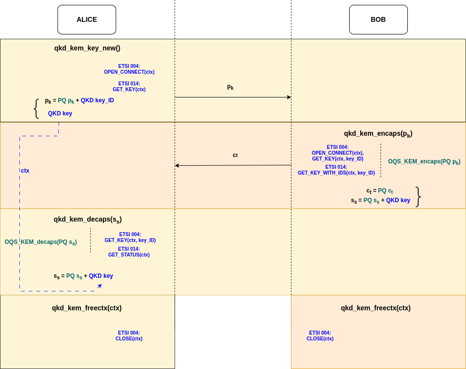

# QKD-KEM Protocol Specification

## Protocol Flow

  

### Key Generation (Alice)

Alice initiates the protocol by generating the key pair and retrieving initial QKD material:

1. Generates KEM keypair `qkd_kem_key_new()`
2. Initializes QKD context as initiator via `init_qkd_context(true)`
3. Retrieves QKD key identifier:
   - ETSI 004: Calls `OPEN_CONNECT()` to establish session and gets key ID
   - ETSI 014: Calls `GET_KEY()` to obtain both key and key ID
4. Transmits both public key and QKD key ID to Bob

### Encapsulation (Bob)

Bob performs encapsulation upon receiving Alice's public key and QKD key ID:

1. Calls `oqs_qkd_kem_encaps()`
2. Initializes QKD context as responder via `init_qkd_context(false)`
3. For ETSI 004:
   - Establishes session with `OPEN_CONNECT()`
   - Retrieves QKD key using `GET_KEY(key_id)`
4. For ETSI 014:
   - Retrieves QKD key using `GET_KEY_WITH_IDS()`
5. Performs PQ encapsulation via `oqs_qs_kem_encaps_keyslot()`

### Decapsulation (Alice)

Alice performs decapsulation upon receiving Bob's ciphertext:

1. Calls `oqs_qkd_kem_decaps()`
2. For ETSI 004: Retrieves QKD key using `GET_KEY(key_id)`
3. Recovers PQ shared secret via `oqs_qs_kem_decaps_keyslot()`